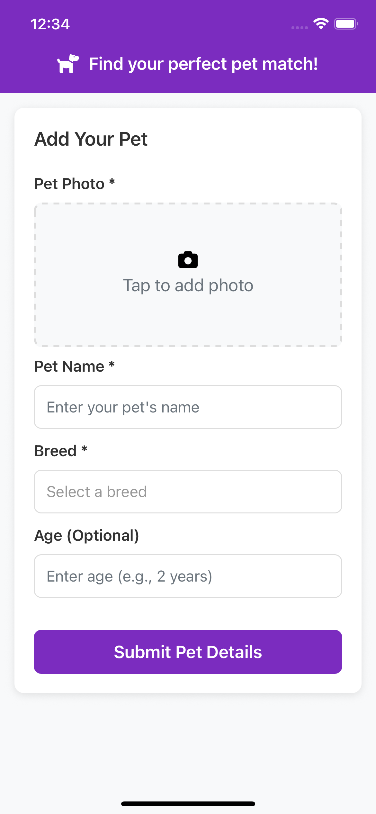
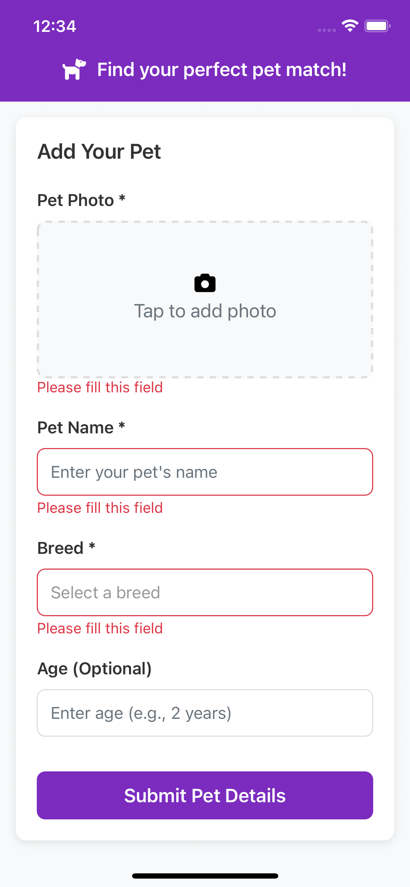

# PetMatcher

PetMatcher is a React Native mobile application that lets users upload pictures of their pets (via camera or gallery), fill in pet details, submit those details to a mock API, and fetch/display random dog images from a public API. The app uses Redux for state management and provides a smooth user experience with input validation, modal pickers, and feedback notifications.

---

## Features

- **Upload Pet Picture**: Capture a pet photo with the camera or select from the gallery.
- **Pet Details Form**: Fill in pet name, select breed from a modal picker, and optionally enter age.
- **Submit Details**: Send the pet data to a mock API using Redux Thunk.
- **Random Dog Images**: Fetch and show random dog images from a public API after submission.
- **Redux State Management**: Uses Redux Toolkit for managing state and async operations.
- **Retry Mechanism**: Automatically retry fetch on delay, and provide a manual retry button on failure.
- **Media Showcase**: Displays three static screenshot images and one video from the `screenshots` folder.

---

## Screenshots and Demo Video

  
  


---

## Installation

### Prerequisites

- Node.js and npm/yarn installed
- React Native development environment set up ([React Native docs](https://reactnative.dev/docs/environment-setup))
- Android Studio and/or Xcode for running on simulators or devices

### Getting Started

1. Clone the repository:

```
git clone https://github.com/VaunshikaG/PetMatcher.git
cd PetMatcher
```

2. Install dependencies:

```
npm install
# or
yarn install
```

3. Start Metro Bundler:

```
npm start
# or
yarn start
```

4. Run the app on Android:

```
npm run android
# or
yarn android
```

5. Run the app on iOS (macOS only):

```
cd ios
pod install
cd ..
npm run ios
# or
yarn ios
```

---

## Project Structure Overview

- `src/` - Source code including components, redux slices, API logic, and utilities.
- `screenshots/` - Folder with sample images and a video demonstration.
- `App.tsx` - Entry point setting up the navigation and theming.
- `redux/` - Redux slices, async thunks, and store setup.

---

## Usage Guide

- Launch the app on your device/emulator.
- Tap "Add Your Pet" section.
- Upload an image via camera or gallery.
- Fill pet name (required) and tap to select a breed from a modal picker.
- Enter pet age optionally.
- Submit form to post pet data to a mock API.
- Upon successful submission, the app fetches and displays a random dog image.

---

## Technologies Used

- **React Native**: Cross-platform mobile app development
- **Redux Toolkit**: State management with slices and async thunks
- **react-native-image-picker**: Picking and capturing images
- **Snackbar**: Toast notifications for user feedback
- **Modal & TouchableOpacity**: Custom breed picker modal UI
- **TypeScript**: Type-safe codebase
- **Material Design** principles for UI/UX consistency

---

## License

This project is licensed under the MIT License.

---
